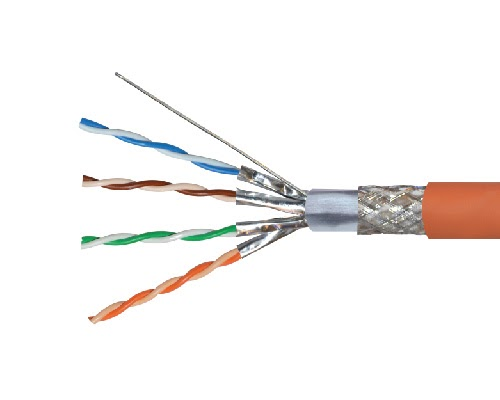
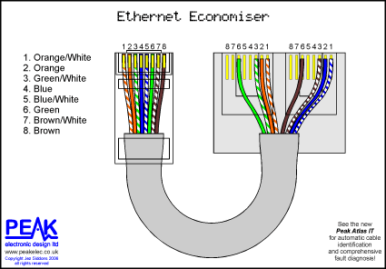
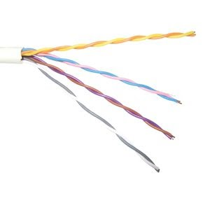
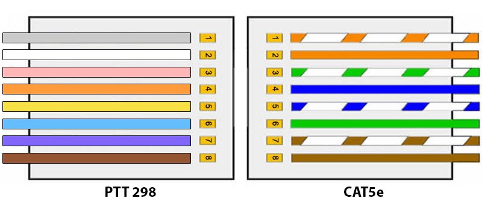
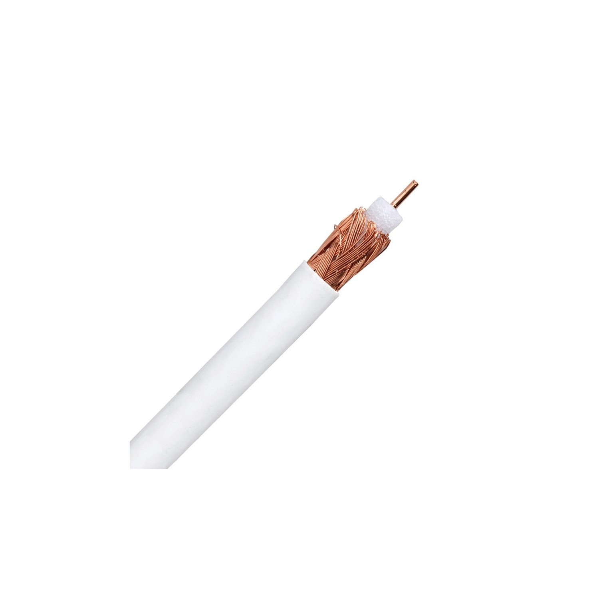
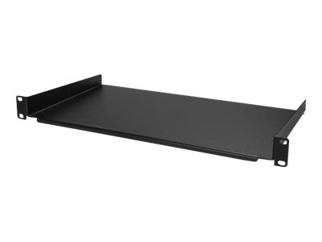
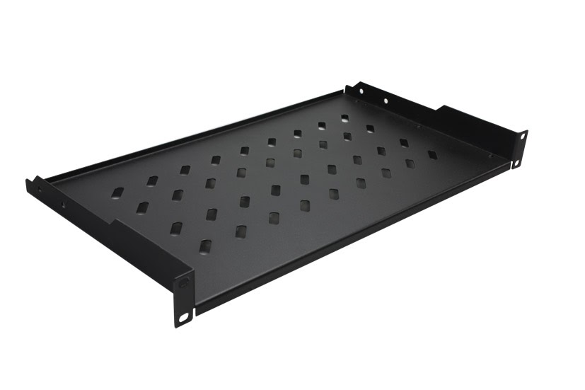

**Par Fabtra et Johannol**

*Membres du forum lafibre.info*

**Septembre 2020 - Février 2021**

[TOC]

# Introduction

## Avertissement

Les conseils donnés dans ce guide ne sont pas forcément à prendre au pied de la lettre, il faut quand même garder un certain recul par rapport aux informations concentrées dans ce document. Il faut garder à l’idée que ce guide est là pour informer et qu' en aucun cas il est universel. Les solutions données dans ce guide peuvent ne pas convenir à vos besoins et il est de votre ressort de vérifier les caractéristiques des produits ou des solutions proposées.

Aussi pour les personnes étant assez tatillons sur les normes et les bonnes pratiques, sachez que sur certains points les normes sont assez floues, de plus toutes la partie fibre en domestique n’est en aucun cas fixée par des normes nous avons donc pris quelques libertés sur certains points afin de faciliter les installations et l’utilisation. Sur ce, bonne lecture à vous !

## Rappel de la norme NF C 15-100

Avoir un point central à côté du compteur électrique, un câblage unique en RJ45 vers toutes les pièces avec un câble Grade "quelque chose", le Grade 3 TV permettant de faire passer le flux Hertzien. Une prise par pièce, et au moins 2 cote à cote dans le salon (pour par exemple la TV + la box). La prise RJ45 peut donc être utilisée à la fois pour y faire passer le téléphone, le réseau internet et un flux TNT.

Sauf exception, les électriciens ne connaissent que cette norme. Donc si on souhaite en sortir, il faut le faire soit même. Mais en neuf, il faudra la respecter pour passer le Consuel.

Hélas, cette norme est assez critiquable, pas sur le point unique qui est une bonne idée, ainsi que le fait d'avoir du RJ45 partout, mais sur le câblage :

- Les câbles "Grade" ne correspondent à rien en informatique, et certains d'entre eux ne respectent pas les normes informatiques avec des paires différentes. Mais d'autres si étant à la fois CAT6A et Grade 3TV. Bref, le bordel
- Passer un signal TNT dans un câble informatique, c'est prendre un gros risque que cela ne marche pas: Il y a beaucoup plus de perte qu'un coaxial, disons qu'on peut se retrouver à ne plus avoir toutes les chaînes au bout de 25 m.
- La norme ne prend pas encore correctement en compte le passage à fibre. Dans l'esprit de la norme, il faudrait une jarretière entre le VDI et la double RJ45 dans le salon, mais rien là dessus dans la norme à part l'arrivée DTIo.
- Sans être strictement la norme mais plutôt la mise en œuvre de celle-ci, les boîtiers VDI utilisés par les électriciens sont parfois hors de prix pour des trucs dépassés.

Mais rien n’empêche de faire mieux que la norme, mais:

- En neuf: Il faut passer le consuel, donc la norme devra être respecté à la lettre, par exemple en faisant attention à ce que le câble soit par exemple à la fois Grade 3TV et CAT6A, puis ajouter un vrai COAX et Optique (ce n'est pas interdit) là ou il faut.
- En rénovation, faire les choix en fonction des contraintes , passage de gaines    possible, arrivée des câbles là où elles sont…

# Câbles cuivre

## Cable Ethernet

### Préambule

Avant toutes choses il faut savoir qu' un câble appelé Ethernet est en général composé de 2 ou 4 paires torsadés de conducteur. Pour un réseau domestique moderne on privilégiera un câble avec 4 paires torsadés pour des raisons de débits.

A noter qu'avec seulement 2 paires de cuivre on ne peut qu’avoir du 100 Mbps maximum dû au “Half-Duplex” (technique de transmission). Les limitations de débits peuvent aussi survenir quand les câbles ne sont pas assez blindés et soumis à de forts parasites. La sections des brins peut aussi jouer de par les pertes par effet joule sur la distance de transmission.

Câble Ethernet

### Type de blindage

Un câble Ethernet peut avoir un blindage le protégeant des interférences électromagnétiques pour conserver l’intégrité des données transférées en protégeant les paires torsadées des parasites. On peut avoir deux types de blindage sur ce genre de câbles, soit du feuillard (papier aluminium), soit de la tresse tout autour des différents brins.

*Voici un tableau résumant les types de blindage possible sur un câble Ethernet :*

| Dénomination | Blindage du câble  | Blindage des paires |
| ------------ | ------------------ | ------------------- |
| UTP          | Pas de blindage    | Pas de blindage     |
| STP          | Pas de blindage    | Feuillard           |
| FTP          | Feuillard          | Pas de blindage     |
| F/FTP        | Feuillard          | Feuillard           |
| SF/UTP       | Feuillard + Tresse | Pas de blindage     |
| S/FTP        | Tresse             | Feuillard           |

### Catégories

*Tableau résumant les différentes catégories et leur débit en fonction de la longueur :*

| Dénomination | Catégorie    | Fréquence | Distance Max | Débit Max | Blindage Utilisé |
| ------------ | ------------ | --------- | ------------ | --------- | ---------------- |
| CAT5         | Catégorie 5  | 100Mhz    | 100 mètres   | 1Gbps     | STP              |
| CAT5e        | Catégorie 5e | 100Mhz    | 100 mètres   | 1Gbps     | STP              |
| CAT6         | Catégorie 6  | 250Mhz    | 55 mètres    | 10 Gbps   | S/FTP            |
| CAT6a        | Catégorie 6a | 500Mhz    | 100 mètres   | 10Gbps    | S/FTP            |
| CAT7         | Catégorie 7  | 600Mhz    | 100 mètres   | 10Gbps    | SF/UTP           |
| CAT7a        | Catégorie 7a | 1000Mhz   | 30 mètres    | 40Gbps    | SF/UTP           |

### Mono ou multibrins

- **Le monobrin**, signifie qu' un fil de la paire torsadée est fait d’un seul et même fil de cuivre, il est donc plus solide mais plus rigide. Il est donc à privilégier lors de tirages sur de longues distances (supérieures à 10m). Il est à écarter absolument ce type de câbles pour faire des jarretières avec des connecteurs mâles sertis sur le câble. De par le diamètre des brins qui ne peuvent tout simplement pas rentrer dans le connecteur. Aussi si les brins rentrent il est possible de ne pas arriver à sertir le connecteur sur les brins, à cause des épaisseurs des torons de cuivre.
- **Le multibrin** quant à lui signifie que un fil de la paire torsadée est faite de plusieurs petit fil, cela donne une plus grande flexibilité au câble. Il faut en général utiliser ce type de câbles pour un brassage dans une baie ou pour relier un équipement à une prise. Il n’est en aucun cas possible de tirer ce genre de câbles dans une gaine par souci de fiabilité dû à la traction exercée sur le câble à l’installation. Vous pouvez cependant utiliser ce type de câble pour ce qu’il ont été conçus c'est-à- dire faire des jarretières. Cependant cela peut s’avérer être long et parfois plus coûteux que d’acheter des patch cords tout faits.

### Astuces et particularités

A savoir que au besoin pour peut “splitter un câble” pour faire passer deux connexions différentes, pour cela on utilise la propriété des câbles à deux paires sur un câble à 4 paires. On peut alors faire passer deux liens à 100 Mbps sur un seul câble. A noter qu'il faut impérativement mettre un splitter de chaque côté, sinon une seule prise du splitter ne fonctionnera qu’en 100Mbps.

*Schéma expliquant le fonctionnement des splitters :*

## Câble PTT 298

### Introduction

Le câble appelé PTT 298 est une norme assez ancienne établie par France Télécom durant la période du plan de déploiement du téléphone partout en France. Tout comme un câble Ethernet moderne, ce genre de câbles comportent 8 fils.La présence d’autant de brins de cuivre peut s’expliquer comme ceci : le réseau était à l’époque analogique et certains fils servaient pour la sonnerie, vérifier si le combiné est raccroché ou non et le signal audio du micro et du haut parleur.

*Câble PTT 298 :* *

### Avertissement

Le câble PTT 298 bien que très similaire à un câble Ethernet CAT5 UTP n’en est pas un. Il peut s’avérer que les performances ne sont pas au rendez-vous, tout bonnement car ce câble n’était pas prévu ni conçu à la base pour transférer des données à très-haut débit. C’est une "norme" créée pour la téléphonie et uniquement la téléphonie.

### Installation

Je ne conseille en aucun cas dans une installation neuve ou rénovée d’installer des câbles PTT 298. De un car cette norme est plus que vieillissante et que comme j’ai pu le dire au dessus, les performances de ce type de câble ne sont garanties que pour un usage purement téléphonique. On préconise alors d’installer un bon vieux câble Ethernet. Mais si, quand bien même vous ne voulez que des prises téléphoniques dans votre habitation, ce genre de câble coûtera sans doute moins cher.

### Adaptation RJ45

On peut brancher des prises (mâles ou femelles) RJ45 sur du câble PTT 298, je vous invite à suivre ce plan de branchements pour que vos branchements soient un minimum normés.

 *Plan de branchement pour PTT 298 :*

## Câble Coaxial

### Introduction

Le câble coaxial est sans doute le câble le plus simple avec comme seule composition, un conducteur au centre et un autre conducteur en périphérie du câble. Ces deux conducteurs sont concentriques. Ce genre de câbles ont été utilisés dans une norme de l’ethernet en 10BASET, puis sont plus majoritairement utilisés pour relier une antenne TV à une TV. Plus récemment les réseaux câblés utilisent du câble coaxial.

*Exemple de câble coaxial :*

*

### Normes

- **RG-59 :**
  - Impédance : 75 ohms
  - Usage : TV TNT - Sat
  - Sensibilité aux parasites : modérée
  - Longueur maximale : 50m
- **RG-6 :**
  - Impédance : 75 ohms
  - Usage : TV TNT - Sat
  - Sensibilité aux parasites : faible
  - Longueur maximale : 100m
- **RG-8 :**
  - Impédance : 50 ohms
  - Usage : TV TNT - Sat, réseaux câblés.
  - Sensibilité aux parasites : faible
  - Longueur maximale : 200m
- **RG-174 :**
  - Impédance : 50 ohms
  - Usage : Antenne 4G, antenne Wi-Fi
  - Sensibilité aux parasites : modérée
  - Longueur maximale : 20m

### Epaisseur du câble

Pour une longueur de câble courte (>10m) on peut se permettre de prendre de prendre du câble de 6mm d’épaisseur qui coûtera bien moins cher que du câble de 11mm d’épaisseur. Pour des longueurs plus longues privilégier du câble de 11mm pour éviter de perdre des fréquences, surtout quand c’est pour de la TV.

### Impédance

Pour de la TV TNT on peut prendre du câble à 75 ohms, par contre pour de l’installation réseau ou de la TV Satellite on privilégiera un câble plus haut de gamme à 50 ohms d’impédance. Il ne faut pas seulement que le câble soit adapté à l’usage mais aussi à l’impédance de l’antenne

### Gaines

- **Les gaines noires :** Les câbles PACT pour un tirage en extérieur, dispose d’un gaine en PE qui n’est pas adaptée au tirage dans des gaines de par la rigidité de ce matériau et qu'il propage le feu en se consumant. 
- **Les gaines blanches :**Les câbles VACT quant à eux sont gainés d’un plastique PVC plus adapté au tirage dans des gaines car c’est un matériau souple. Aussi à l’instar du PE il se consume beaucoup plus lentement que du PE.

## Fibre

### Préambule

Il faut savoir que toutes les parties comportant de la fibre dans ce guide ne font référence à aucune norme en vigueur, de plus pour les installations domestiques nous privilégierons des jarretières et des corps de traverses pour les connecter entre elles. Cette liberté est prise car quasi personne n’a de matériel pour faire des soudures sur de la fibre chez soi. Aussi, tout comme il n’existe pas de normes pour tirer de la fibre dans un domicile, il en est de même pour les prises dans la GTL et sur les murs.

### Jarretière fibre

#### Différents types de fibre

On distingue 2 types de fibre commercialisées :

- **Les fibres monomodes** : Ce sont les fibre optique les plus récemment conçues, elles transmettent la lumière via un seul faisceau ce qui permet des débits plus importants et une atténuation du signal moindre sur des longues distances. Avec le bon matériel on peut arriver à 100 Gbps voire plus. Les jarretières monomodes sont par convention Jaunes. Elles sont appelées OS1 / OS2.
- **Les fibres multimodes** : Ce sont les premières fibres à avoir été conçues, la lumière se transmet par réfraction dans la fibre, cela induit des pertes et donc de l’atténuation du signal. La distance de transmission est limitée de part la réfraction de la lumière dans la fibre. Par convention les jarretières OM1 et OM2 sont orange et les OM3 et OM4 sont bleu turquoise. Les jarretières fibres OM5 sont vertes. A savoir que les fibre OM1 et OM2 supportent des débits de 10Gbps avec les normes 10GBASE-SR/LX4/LR. Pour ce qui est des fibre OM3 et OM4 ce sont des débits de 25,40 voire 100 Gbps. Les fibres OM5 ont été conçues pour faire passer au moins 4 longueurs d’onde sur une seule et même fibre permettant d’avoir les mêmes débits que sur les deux normes précédentes.

| Exemple de jarretière OS1 / OS2                              | Exemple de jarretière OM1 / OM2                              |
| ------------------------------------------------------------ | ------------------------------------------------------------ |
| !images/jarretiere-os1-os2.png) | *!images/jarretier-om1-om2.png) |
| **Exemple de jarretière OM3 / OM4                            | :**Exemple de jarretière OM5                                 |
| :**!images/jaretiere-om3-om4.png) | **!images/jarretier-om5.png) |

#### Duplex ou Simplex

Une fibre **simplex** est tout simplement un seul brin de fibre, c’est ce qu’utilisent les opérateurs avec leur infrastructure fibre, on a un seul brin qui nous transmet le signal. Le signal envoyé et reçu ne sont pas sur la même longueur d’onde c’est pour cela que l’on peut à la fois envoyer et recevoir sur la même fibre.

La fibre en **duplex** quant à elle signifie que l’envoi se fait sur une fibre et que la réception se fait sur une autre, on a alors obligatoirement un couple de fibre pour transmettre le signal. Pour l’envoi sur certaines documentation vous trouverez peut être l’abréviation Tx et Rx pour la réception.

#### Différents polissages

On peut distinguer deux types de polissages pour des connecteurs, connecteurs que l’on abordera en détail juste après.

- **Le polissage UPC** : Ce polissage est “droit” c’est à dire que le polissage est perpendiculaire à la fibre, dans le cas de transmission sur plusieurs longueurs d’ondes c’est ce type de polissage qui offre les meilleures performances d’un point de vue pertes à l’insertion. La couleur du connecteur pour ce type de polissage est bleu.
- **Le polissage APC** : Il est effectué à 8° d’angle, c’est le type de polissage le plus utilisé dans les réseaux PON. Il est différentiable par la couleur de son connecteur qui est vert.

#### Différents connecteurs

##### **Connecteur SC**

Ce connecteur est surement le plus répandu car utilisé dans toutes les infrastructures télécom FTTH. C’est un connecteur beaucoup moins fragile que le LC car il n’y a pas de petit loquet en plastique.

| !images/connecteur-sc-upc.png) | !images/connecteur-sc-apc.png) |
| ------------------------------------------------------------ | ------------------------------------------------------------ |
| *Exemple de connecteur SC (SC-UPC et SC-APC) :*  **          |                                                              |

##### **Connecteur LC**

Ce connecteur est le plus répandu sur les modules de conversion de signal. Il est utilisé dans les entreprises et dans les infrastructures des opérateurs telecom.

*Exemple de connecteur LC (LC-UPC et LC-APC) :*!images/connecteur-lc-upc.png)!images/connecteur-lc-apc.png)

##### **Connecteur ST** :

Ce connecteur était surtout utilisé avec de la fibre multimode, il tombe de plus en plus en désuétude… Malgré tout, il est toujours utilisé dans les réseaux d’organisations. Comme les deux précédent connecteurs il est possible d’avoir un polissage UPC ou APC, mais l' UPC est clairement plus répandu du sans doute aux perte moins importantes en multimode.

*Exemple de connecteur ST (ST-UPC Duplex Multimode et ST-APC Monomode Duplex):* *!images/connecteur-st-upc.png)**!images/connecteur-st-apc.png)*

##### **Connecteur FC** 

Ce connecteur semble similaire au ST à une différence près, celui-ci est vissable alors que le ST est à baillonette. Tout comme le connecteur précédent, il est surtout utilisé dans les réseaux d'organisations. Il supporte les deux types de polissage.

*Exemple de connecteur FC :**!images/connecteur-fc-upc.png)**!images/connecteur-fc-apc.png)*  

#### Choix de la jarretière

Pour le type de fibre il est préférable de prendre du monomode pour pouvoir faire évoluer réseau en 10Gbps, le multimode lui permet une évolution limité de part ses 1Gbps maximum.

Pour le choix du connecteur, il est conseillé de partir sur du LC-UPC et du SC-UPC, avec du SC sur les prises et les modules Keystone et du LC pour brancher sur les équipements actifs.

Pour ce qui est du type de polissage, l'UPC est à privilégier car encore une fois le matériel actif utilise pratiquement exclusivement ce type de polissage. Sachez aussi que l'on peut très bien prendre une jarretière en SC d’un côté et en LC de l’autre mais il faut impérativement avoir le même polissage des deux côtés si on veut coupler un SC à un LC.

### Coupler deux fibres

Il y a trois techniques pour “coupler” deux fibres entre elles :

- La soudure :
  Cela nécessite du matériel de pointe pour dénuder, cliver, souder et protéger l’épissure réalisée, en général on utilise cette technique dans les réseaux télécoms ou même des réseaux d’organisations.
  *Exemple de matériel nécéssaire pour une soudure :**!images/materiel-soudure.png)*
- L’épissure mécanique :
  Cette technique consiste à aligner mécaniquement deux fibres, 3M propose une solution appelée FibrLok mais nécessite au moins une cliveuse et de quoi dénuder la fibre. Malgré qu'il n’y ait pas besoin de soudure, cela reste peu accessible. Sans compter le gros point noir de cette technique, qui est la durabilté de l’épissure au fil des années.
  *Exemple de module Fibrlok :**!images/epissure-mecanique.png)*
- Le corps de traversée :
  Le corps de traverse est une pièce en plastique ou en métal qui permet de mettre deux connecteurs en contact et ainsi relier deux jarretières sans soudure ni épissure mécanique. Pour des raisons de praticité c’est cette technique qui, dans bien des cas, est utilisée. Mais on paye le prix de la simplicité avec des pertes de l’ordre de 0.1 à 0.2 dB à l’insertion.
  *Exemples de corps de traversée:*
  !images/corps-traversee-1.png)!images/corps-traversee-2.png)

### Installer des jarretières

Il y a quelques précautions à prendre quand on veut tirer des jarretières dans des gaines :

- **Rayon de courbure :**
  Le rayon de courbure est très important car la fibre optique si elle est courbée à un certain niveau la lumière vient à ne plus se réfléchir dans la fibre. Si vous venez à dépasser les valeurs ci-dessous, vous pourriez avoir des pertes de signal, voire pas de signal du tout. Dans tous les cas, pas d’angle à 90° avec de la fibre.

  - *Liste des rayons de courbure en fonction du type de fibre :
    **Monomode**
    *OS1 : 5 cm*
    *OS2 : 5 cm
    **Multimode***
    *OM1 : 15 cm*
    *OM2 : 15 cm*
    *OM3 : 15 cm*
    *OM4 : 15 cm*
    *OM5 : 15 cm*

- **Tension de traction :**
  Une jarretière bien que renforcée avec du kevlar dans la gaine plastique est beaucoup moins résistante à la traction, de par qu’il n’y a pas de métal dans le câble ce qui dans des câbles classiques augmente grandement la résistance du câble. On veillera donc lors du tirage de la jarretière à ce que le connecteur soit enroulé dans du scotch d'électricien, et même de lubrifier la jarretière avec un lubrifiant adapté (ou non). La disposition de la gaine est aussi décisive, il faut des courbes vraiment larges pour éviter que le connecteur frotte trop sur les parois.

- **Résistance au pincement :**
  La fibre optique est très sensible aux pincements, s’il s’avérait que la fibre soit pliée, il est possible que la fibre ne transmette plus la lumière, ou même pire qu’elle soit cassée. Veillez donc à manipuler les jarretières avec le plus grand soin.

- **Taille des connecteurs :**
  Pour s’assurer que les connecteurs puissent passer dans la gaine, je vous met à disposition les dimensions des connecteurs.

  - SC : 8 mm x 10 mm
  - LC : 5 mm x 10 mm
  - ST : 10 mm de diamètre
  - FC : 10mm de diamètre

  

## Tableau

### Tableau type "Électricien"

#### Point abréviations et appellations

La VDI ou Voix Données Image est l'appellation franco-française pour appeler un réseau informatique domestique tout comme on appelle une GTL la zone ou il y a le tableau électrique mais aussi le tableau VDI ou autrement appelé “coffret de communication”.Par ailleurs, il faut savoir que la majorité des fabricants de matériel électrique se sont rapidement vus faire du matériel réseau pour répondre à la norme NF C 15-100 vue auparavant.En général c’est ce genre de matériel que commandent et posent les électriciens sûrement par simplicité car ils ont le catalogue de telle ou telle marque et que cela remplit largement les usages des personnes qui veulent juste un réseau fonctionnel.Attention toutefois au matériel choisi qui peut vite revenir onéreux pour des normes dépassées depuis des années, assurez-vous de prendre des catégories adaptées à vos besoins pour ne pas être limité par la suite par les capacités de votre réseau.

#### Schneider Electric

Schneider est un fabricant de matériel électrique français proposant depuis quelques années des solutions pour les réseaux domestiques.

Leur solution la plus connue est sans doute la gamme LexCom, ils proposent des kits à la vente avec des noyaux RJ45, un répartiteur pour le téléphone et un pour la TV.

Ces kits sont clés en main, il y a déjà tout pour faire le brassage, les branchements et les connexions entre la box. Autre précision, les modules vendus se montent comme des disjoncteurs ou tout autre matériel électrique sur un rail DIN.

Ces kits sont accompagnés systématiquement avec un bandeau de 3 prises, ce qui est un avantage pour brancher l’alimentation d’une box, d’un amplificateur pour la TV ou bien un Switch pour connecter toutes les prises du logement si cela est nécessaire.

*Exemple d’un tableau VDI LexCom :**!images/tableau-vdi-lexcom.png)**!images/tableau-vdi-lexcom2.png)*

#### Legrand

Legrand est incontestablement le leader du matériel électrique en France, donc dans bien des cas votre électricien ou même vous, vous pencherez sans doute vers cette marque. Tout comme Schneider ils proposent des kits VDI tout prêts, leur gamme se nomme Full Media pour les produits destinés au grand public.

Legrand semble toutefois s’être adapté aux attentes des clients en proposant des kits directement adaptés aux nombre de pièces que vous possédez dans votre logement. Les modules sont eux aussi fixés grâce à des rails DIN.

*Exemple d’un tableau FullMedia :**!images/tableau-vdi-fullmedia-1.png)**!images/tableau-vdi-fullmedia-2.png)*

#### Compatibilité avec une installation fibre

##### Arrivée Fibre opérateur

Sachez que on peut installer une PTO (Prise de Terminaison Optique) ou appelé DTIo (l’équivalent du DTI cuivre mais pour la fibre) directement dans votre tableau VDI lors d’une installation fibre, de plus en plus de techniciens ont des PTO montables sur des rails DIN. Toutefois il est possible d’acheter un DTIo séparément au format "disjoncteur" encore une fois montable sur un rail DIN. De ce que l’on a pu voir il n’y a qu’une seule marque reconnue qui proposait un produit de ce genre. Cette marque n’est autre que Hager.

  *Exemple de DTIo posé par un technicien dans une VDI et un DTIo Hager :**!images/dtio-vdi.png)*!images/dtio-hager.png)

##### Réseau fibre domestique

Il faut savoir que c’est relativement difficile de mettre en place un réseau fibre domestique avec ce genre de matériel car dans bien des cas les modules sont dans un format propriétaire et donc peu modulaire ce qui limite les possibilité d’évolution vers une installation fibre optique. Sachez que c’est néanmoins possible mais que cela relève plus d’un bricolage que d’une installation “officielle”.

*Exemple de bidouillages déjà vus sur le forum :**!images/bidouillages1.png)**!images/bidouillages2.png)*

### Baie informatique 19”

#### Choix de la baie

La baie en 19” de large pour les rack est le standard pour le matériel réseau ou de serveur, 19” est égal à environ 50 cm de large pour les racks. De part sa standardisation on peut trouver beaucoup de matériel au format rack 19” allant d’un simple bandeau de prises à des amplificateur de son pour la musique.

Pour le choix de la baie il y a en général deux critères importants qui se doivent d’être vus, on choisit sa baie en fonction du nombre de U (unité de rack) et de la profondeur de celle-ci. En effet, si on possède des switchs profonds on privilégiera une baie d’au moins 600 mm de profondeur. Sachez tout de même qu’en général une baie de 450 mm de profondeur suffit amplement pour le matériel domestique qui sera installé.

Une caractéristique intéressante aussi sur certaines baies est la présence de capots amovibles sur les côtés pour faciliter l’installation des câbles et du matériel.La baie au format 19” est en général mal intégrée dans l’habitation, on favorise donc le garage ou tout autre pièces peu fréquentée pour l’installer.

*Exemples de baies :*Baie 19 pouces 6U avec vitre et panneau arrière sur charnières.!images/rack-19-6u.png)
Baie 19 pouces 9U avec panneaux latéraux escamotables!images/rack-19-9u.png)

#### Matériel rackable 19”

On peut trouver pas mal de modules rackables différents mais voici les plus utilisés dans une utilisation domestique :

##### Le panneau 24 ports Keystone

:!images/keystone-24.png)

Ce genre de module fait en général 1U de hauteur et permet d’accueillir 24 modules Keystone, ce genre de modules permet par exemple de mettre aussi bien des corps de traverses fibre ou des prises HDMI ou bien dans notre cas des noyaux RJ45. Il y en a de toutes les sortes mais je conseille tout de même de choisir un panneau avec au dos la possibilité de serrer les câbles au panneau avec des colliers de serrage pour pérenniser l’installation.

##### **Le panneau passe-câble** :

!images/passe-cable-crochet.png)!images/passe-cable-brosse.png)

On retrouve ici deux types de modules passe-câble, l’un est à crochet l’autre est à brosse. Ils ont tous les deux la même utilité : faire un passage des câbles de façon propre et esthétique, ces racks ne sont en aucun cas obligatoires. Dans des usages professionnels cela peut s'avérer utile lors de gros brassages pour garder une baie propre et “lisible” en cas de panne.Ces modules en fonction des modèles peuvent faire 1 ou 2U de hauteur.

##### **L’étagère rackable** :

Utile dans bien des cas pour mettre un NAS ou une Box qui ne sont pas rackables, ces étagères font généralement 1U de hauteur mais attention à prévoir aussi la hauteur du produit qui sera installé dessus. Comme par exemple un NAS qui peut prendre 4-5 U en position verticale.

##### **Le bandeau de prises** :

!images/rack-prise.png)

Bien qu' étant une exception dans cette liste c’est un élément essentiel de votre baie, le bandeau de prises est en général obligatoire car servant à alimenter tout le matériel actif de la baie, que ce soit la box en passant par le NVR pour la vidéosurveillance ou même juste le switch. Il existe aussi des modèles avec disjoncteur/parafoudre intégré pour protéger vos appareils.

##### **Rail DIN Rackable** :

!images/rack-rail-din.png)

Ce genre de module peuvent s’avérer utiles si on veut par exemple mettre le DTI cuivre dans la baie ou même le DTIo qui sont en général fixés via un rail DIN comme on a pu le voir au-dessus avec les DTIo.

##### **Panneau de brassage fibre** *:*

!images/rack-brassage-fibre.png)

Ce rack est en général utilisé dans des armoires FTTH et non pas dans des installations domestiques, néanmoins si on a beaucoup de fibres cela peut être intéressant mais c’est peu probable d’avoir plus de 10 liens fibre dans une maison. Mais sachez que ce genre de modules ne sont pas en général utilisés avec des jarretières de chaque côté. Son utilisation normale est avec un pigtail et une soudure lovée dans une cassette.

##### **Module Thermomètre et Ventilateurs** *:*

!images/rack-ventilateur.png)

Cet élément “actif” de la baie est composé d’un bloc d’alimentation, d’un affichage LCD et d’un capteur de température. Il y a aussi deux ou quatre ventilateurs, ils servent à extraire l’air chaud de la baie. Ce genre de matériel est souvent installé dans des baies avec des serveurs.

##### Cache 1U :

!images/rack-cache.png)

Ce type de matériel est purement esthétique, il n’est en aucun cas obligatoire, cela peut être utile si on veut cacher tous les câbles et avoir quelque chose de propre si par exemple votre baie est dans un endroit visible.

##### Ecrous Cage / Vis** :

!images/rack-vis-1.png)!images/rack-vis-2.png)

Ce genre d’écrous se mettent sur le rail vertical percé de la baie, puis on y met le module et on le visse, c’est un élément indispensable d’une baie. Il existe plusieurs types de kit d’écrous cage / vis avec des vis cruciformes ou bien Allen (6 pans creux) permettant une couple de serrage de la vis beaucoup plus important sans trop forcer.

### Baie Informatique 10”

#### Choix de la baie

La baie informatique au format 10” est beaucoup moins présente car c’est un format assez restrictif de part la largeur limitée des modules. Et la réputation de ce format d’être non standard, ce qui est faux au passage. Par contre il y a moins de modules pour les baies 10” que 19 c’est une certitude. Aussi pour ce genre de baies il y a moins de matériel actif rackables en 10” c’est aussi à prendre en compte. Par contre il y a un gros point fort pour ces petites armoires c’est l’encombrement qui est juste minime par rapport à une 19” massive. Mais cet encombrement réduit tend à rendre plus compliqué de rentrer tout le matériel que l’on souhaite mettre à l'intérieur comme par exemple les jarretières Ethernet peuvent bloquer la fermeture de la porte. A noter aussi qu'il y a beaucoup moins de diversité de modèles de baies, donc cela ne peut, dans certains cas, pas convenir du tout à vos besoins.

*Exemple de baies :*
Baie 10 Pouces 6U avec panneaux latéraux amovibles!images/rack-10pouces-6u.png)

Baie 10 pouces 9U
!images/rack-10pouces-9u.png)

#### Matériel rackable 10”

Ces modules sont sensiblement les mêmes que ceux en 19 pouces, c’est pour cela que nous n’avons pas fait de descriptif pour ces modules-ci. 

##### Panneau 12 emplacements Keystone :

!images/rack-10-keystone.png)**

##### **Bandeau de prises :**

*!images/rack-10-prise.png)

##### Étagère rackable :

!images/rack-10-etagere.png)**

##### **Rail DIN rack :****

!images/rack-10-rail-din.png)**

##### **Passe câbles :**

!images/rack-10-passe-cable.png)!images/rack-10-passe-cable-2.png)

##### **Cache 1U :**

*!images/rack-10-cache.png)**

## Matériel Actif

#### Marques de Matériel

##### Introduction

Cette partie du guide a pour but de présenter succinctement les marques qui ont fait leurs preuves sur leur marché ainsi qu’à qui s’adressent leurs produits. Cette liste n’est en aucun cas la liste de toutes les marques de matériel existantes, loin de la. Néanmoins on présente ici des constructeurs plus ou moins accessibles, plus ou moins professionnels. On peut voir aussi que certains se sont spécialisés dans un type bien précis de produits.

##### Cisco

Cisco Systems est une entreprise informatique américaine spécialisée, à l’origine, dans le matériel réseau, et depuis 2009 dans les serveurs. Il produisent du matériel tel que des switchs, des routeurs, des access-points Wi-Fi. Par contre leur matériel est relativement cher car leur cible sont les professionnels et les organisations. De plus, pour une utilisation domestique, les fonctionnalités disponibles ne sont en général pas ou peu exploitées.

##### Netgear

Netgear est une entreprise informatique connue pour ses équipements pour les réseaux informatiques et les réseaux de télécommunications. Il se sont surtout fait connaître pour leur produits Wi-Fi tel que des access points ou des solutions de réseau Wi-Fi mesh. Ils ont toutefois une gamme de routeurs et de switchs manageables qui sont relativement accessible pour le grand public.

##### D-Link

D-Link est une entreprise taïwanaise qui conçoit et fabrique du matériel pour les réseaux informatiques. Ce fabricant s’est fait une renommée en France auprès des PME et TPE pour leur matériel de qualité pour un tarif abordable pour une entreprise de ces gabarits. Ils se sont spécialisés dans des switchs avec des fonctionnalités et des prix intéressants.

##### Zyxel

Zyxel, tout comme D-Link est une entreprise taïwanaise qui conçoit et produit du matériel pour les réseaux télécom et informatiques. Il se sont spécialisés sur un produit en particulier à sa création : les routeurs avec ADSL ou SDSL. Ils se sont ensuite diversifiés dans les switchs ainsi que dans les access-points Wi-Fi.

##### Mikrotik

Mikrotik est une entreprise lituanienne produisant depuis le début des années 2000 du matériel professionnel à des prix défiant toute concurrence. Ce sont des outsiders dans le milieu de la conception et la fabrication de matériel informatique. Ils se sont fait connaître en proposant des switchs 10G abordables et utilisables pour le grand public.

##### Ubiquiti

Ubiquiti est une société américaine concevant du matériel pour les réseaux informatiques depuis 2005. Tout comme Mikrotik ce sont des outsiders dans ce milieu. Ils se sont fait connaître avec leurs solutions de réseaux Wi-Fi. Solutions qui permettent de simplifier le paramétrage du réseau.

##### TPlink

TPlink est une entreprise chinoise concevant et commercialisant du matériel réseau tel que des switchs, des routeurs ainsi que des access-points wifi. Ils sont surtout connus pour proposer du matériel de qualité à des prix abordables ce qui à peu à peu hissé cette marque comme référence auprès du grand public.

#### Routeur

##### Introduction

Un routeur est un matériel actif essentiel dans un réseau, cela permet d’interconnecter deux réseaux (dans notre cas un réseau public et un réseau privé). Il possède de nombreuses fonctionnalités intéressantes.

##### Différentes technologies d’accès

- **xDSL**
  DSL pour Digital Subscriber Line est une technologie de transmission de données sur paire de cuivre soit nos bonne vielles lignes téléphoniques. Voici quelques variantes répandues du DSL :
  - *ADSL* pour Asymetric, cela signifie qu'il y a plus de débit descendant que montant. C’est encore la connexion la plus répandue en France.*Variantes* : ADSL (débit max 3Mbps), ADSL2 (débit max 12Mbps), ADSL2+ (débit max 24Mbps)
  - *VDSL* pour Very high bitrate, est une évolution de l’ADSL permettant d’allouer plus de fréquences au débit descendant. Cependant ce protocole permet d’obtenir des débits intéressant seulement sur le premier kilomètre de la ligne. C’est pourquoi les opérateurs n’activent ce protocole que sur les lignes de moins d’un kilomètre.*Variantes* : VDSL (débit max 54Mbps), VDSL2 (débit max 95Mbps)
  - *SDLS* pour Symetric, est une variante du protocole DSL permettant d’avoir autant de fréquences pour le débit montant et le débit descendant . Mais en général le débit de ces lignes est limité car cette technologie n’a pas reçu d’évolution comme l’ADSL. Ce genre de liaisons sont quant à elles réservées à un usage professionnel. Contrairement à de l’ADSL on peut utiliser plusieurs paires de cuivre afin de multiplier les débits.
    Variantes : SDSL (débit max 2Mbps)
    *Connecteur RJ11 sur un routeur/box xDSL :*
    ***!images/connecteur-rj11.png)*
    **
- **DOCSIS**
  La norme DOCSIS à été créée dans l’unique but de réutiliser les réseaux de câbles coaxiaux afin de fournir une connexion internet haut-débit. En France cette technologie est utilisée sur le réseau de SFR-Numéricable avec leurs offres fibre THD considérées comme du FTTLa (Une armoire avec du matériel actif transforme le signal lumineux des fibres optiques venant du central et envoie un signal via le réseau coaxial). Cette méthode à permis à Numéricable de proposer rapidement des connexions avec des performances quasi inégalables avec du xDSL. Ce réseau est peu à peu délaissé pour faire place au FTTH.
  Variantes DOCSIS : 1.0 (40Mbps down 10Mbps up), 2.0 (40Mbps down 30Mbps down), 3.0 (1Gbps down 200Mbps up), 3.1 (10Gbps down 1 Gbps up) 4.0 (10Gbps symétrique)
  *Connecteur coaxial type F sur un routeur Docsis Arris :*
   *!images/connecteur-docsis.png)*
- **PON**
  Le PON est un type de réseau fibre de bout en bout permettant de proposer du FTTB et du FTTH. Ce type de réseau permet d’avoir une fibre au central pour au maximum 128 clients. Ce type de réseau ne comporte que deux éléments actifs entre le central et le matériel chez le client.
  Variantes PON : GPON (débits mutualisés 2.4Gbps down 1.2Gbps up), 1G-EPON (E pour ethernet, débits mutualisés 2.4Gbps down 1.2Gbps up), 10G-EPON (E pour Ethernet débit mutualisés 10Gbps down 1Gbps up), XGPON (débit mutualisé 10Gbps down 1,25Gbps up), XGSPON (débit mutualisé 10Gbps down 10Gbps up), NGPON (10Gbps symétrique par longueur d’onde)
  *Connecteur SC-APC d’un ONT GPON :*
   *!images/connecteur-pon.png)*
- **LTE**
  LTE pour Long Term Evolution est nom de la norme englobant la 4G, 4G+, etc… C’est de plus en plus un alternative au xDSL dans des zones ou les lignes sont longues et que la fibre n’est pas encore déployée, seul petit bémol de cette technologie, c’est éventuellement le fait que c’est un réseau mutualisé avec tous les utilisateurs connectés sur l’antenne.
  Cela peut induire une saturation et une baisse des débits lors des pics de consommation de data (le soir et les week-end notamment). On peut évidemment accéder à internet via la 4G avec un téléphone mais dans le cadre d’un réseau domestique on privilégiera un routeur 4G comme ceux de Netgear, TP-Link ou Huawei. Ce genre de routeurs ont des antennes internes mais pour avoir une stabilité accrue il est préférable de brancher une antenne qu'on installera comme une antenne TV sur le toit. Le connecteur pour l’antenne peut être soit du TS-9 soir du SMA. Pour accéder aux services il faut évidemment un forfait avec une carte SIM comme pour un téléphone.
  *Exemple de routeur LTE :*
  *!images/routeur-lte-1.png)*
  ***!images/routeur-lte-2.png)***
  **          *Exemple d’antennes omni-directionnelle et directionnelle :* 
  *!images/antenne4g-1.png)***
  *Connecteurs pour brancher une antenne:*** 

##### Différentes connectiques d’un routeur

###### **Port RJ45** : 

C’est le standard pour les connecteurs réseau, il équipe la grande majorité de matériel informatique.

*Exemple port RJ45 et prise RJ45* :

###### **Port GBIC** :

C’est un port permettant de mettre des modules pour fibre optique ou cuivre, les débits maximums sur ces modules sont de 1 Gbps. Il est de moins en moins utilisé.

*Exemple port GBIC et module GBIC :*

###### **Port SFP** :

Ou appelé Mini GBIC il est le remplaçant du GBIC, son format est beaucoup plus petit que son grand frère, il a les même capacité avec 1 Gbps de capacité pour le débit.

*Exemple de port SFP et module SFP :*

###### **Port SFP+** : 

C’est une évolution du port SFP et propose des débits jusqu'à 10 Gbps sur fibre optique ou cuivre. Il a le même form factor que le SFP

*Exemple de port SFP+ et module SFP+:*

              

###### **Port SFP28** : 

Ce port est une mise à niveau pour répondre à des besoins en débits importants, ce type de modules permet d’atteindre des débits de 25Gbps. Cette norme utilise le même format de ports que le SFP et SFP+. 

*Exemple port SFP28 et module SFP28* :

###### **Port QSFP+** : 

Ce type de matériel est utilisé dans les installations d'opérateurs télécom car le débit maximal est de 40Gbps. Le port n’est pas du même format que le SFP et SFP+. A savoir qu'on peut mettre des câbles cuivre mais qu'il est préconisé de le faire avec des modules fibres.

Le QSFP+ est en fait 4 SFP+ regroupé dans un seul connecteur on peut alors avoir des câbles DAC avec d’un côté un connecteur QSFP+ et de l’autre 4 connecteurs SFP+.

*Exemple de port QSFP+ et module QSFP+ :

*Exemple de DAC QSFP+ et 4xSFP+ :

**********

###### **Port QSFP28** : 

Tout comme le QSFP+ il regroupe 4 SFP28 dans un seul port permettant d’atteindre 100 Gbps sur un seul port. Pour les câbles DAC c’est le même principe du QSFP+.

*Exemple du port QSFP28 et module QSFP28* :

#### Switch

##### Introduction

Définition d’un switch Ethernet : Un switch, commutateur ou commutateur réseau en français, est un équipement qui fonctionne comme un pont multiports et qui permet de relier plusieurs segments d'un réseau informatique entre eux. Un switch peut être rackable ou non. Ils peuvent gérer des VLAN, des réseaux virtuels qui permettent de segmenter et de sécuriser le réseau local. Ce sont, pour donner une image à cette technologie, des cloisons pour réseaux à l'intérieur même d’un seul et même switch.

##### Différents débits d’un switch

Normes de débit Ethernet :

| Débit    | Nom de la norme   | Moyen de transmission       | Etat de la norme |
| -------- | ----------------- | --------------------------- | ---------------- |
| 10Mbps   | 10BASE-T          | Câble Ethernet CAT3 ou 5    | Obsolète         |
| 100Mbps  | 100BASE-T         | Câble Ethernet CAT5         | - en - utilisé   |
| 100Mbps  | 100BASE-FX        | Fibre Optique               | - en - utilisé   |
| 1Gbps    | 1000BASE-T        | Câble Ethernet CAT5e        | Encore utilisée  |
| 1Gbps    | 1000BASE-X        | Fibre optique               | Encore utilisée  |
| 2.5 Gbps | 2.5GBASE-T        | Cable Ethernet CAT 6/6a/7   | Encore utilisée  |
| 5 Gbps   | 5GBASE-T          | Cable Ethernet CAT 6/6a/7   | Encore utilisée  |
| 10Gbps   | 10GBASE-T         | Cable Ethernet CAT 6/6a/7   | Encore utilisée  |
| 10Gbps   | 10GBASE-SR/LX4/LR | Fibre optique               | Encore utilisée  |
| 40Gbps   | 40GBASE-X         | Fibre optique/ Câble cuivre | Inaccessible     |
| 100Gbps  | 100GBASE-X        | Fibre Optique               | Inaccessible     |

##### Différentes connectiques sur un switch

Pour ce qui est des connectiques sur un switch se référer à la partie connectique des routeurs car c’est sensiblement la même chose.

##### Fonctionnalités d’un switch

- **PoE** : Le Power over Ethernet est une fonctionnalité permettant d’envoyer par le réseau du courant 12v ou 24v et ainsi d’alimenter des points d’accès wi-fi ou des caméras IP.
- **Switch manageable de Niveau 2** : Sur ce type de switchs on peut faire des VLAN mais que de niveau 2 en adressant un port du switch à un VLAN. Néanmoins cela permet de sécuriser son réseau à moindre coût étant donné que le matériel coûte moins cher, il faudra cependant y coupler un routeur pour pouvoir par exemple accéder à internet. On peut faire grâce au mode Trunk transiter plusieurs VLAN dans un seul câble pour faire le routage.
- **Switch manageable de Niveau 3** : Un switch de ce genre est à la fois un commutateur et un routeur: il peut être considéré comme un routeur avec plusieurs ports Ethernet et des fonctions de commutation. Il peut donc à la fois créer des VLAN et faire du routage entre eux.
- **QoS** : C’est une technologie permettant d’optimiser l'utilisation du débit en paramétrant des quotas par port ou par réseau et ainsi prioriser les flux en fonction de leur type ou encore de leur criticité. En général les switchs manageables de niveau 3 intègrent nativement cette fonction.
- **“Smart Switch"** : Désigne une appellation une version simplifiée du Switch de Niveau 3 et permet de configurer simplement des QoS et des VLANs. Ils sont en général équipés d’interface graphique accessible via un navigateur web pour gérer tous les paramètres de la machine.

#### Vidéo-surveillance

##### Introduction

Les caméras IP sont des caméras alimentées via le réseau ou non permettant de faire de la surveillance généralement contre des cambriolages. Il y a aussi plusieurs critères à regarder pour choisir son modèle de caméra. Il faut aussi garder en mémoire que c’est utile de capter de l’image, mais les conserver c’est mieux.On a en général un enregistreur couplé à ces caméras pour les raisons citées ci-dessus.

##### Caméra IP

On peut distinguer deux types de caméras IP, distinction qui se fait de par son moyen de transmission :

- **Ethernet - PoE**
  Ce genre de caméras sont par définition filaires puisque elles sont connectées via un câble Ethernet et peuvent être alimentées soit via une alimentation externe soit directement via le câble Ethernet avec le PoE qui permet d’envoyer une tension d’alimentation avec le câble faisant transiter aussi les données. Pour utiliser le PoE il faut soit avoir un injecteur PoE, soit le NVR supporte et injecte nativement du PoE, soit le switch installé dans votre baie est compatible PoE. Il faut veiller à ce que les consommations soient en adéquation avec le matériel injectant le courant, afin que la caméra ne soit pas sous-alimentée.
  *Exemple de caméra IP alimenté ou non via PoE :*

  

- **Wi-Fi**
  Une caméra IP peut être connectée au réseau via le Wi-Fi, cela peut s’avérer utile si on a une source de courant mais pas de solutions pour amener le réseau à l’endroit où est postée la caméra. Par contre dans ce cas de figure l’alimentation externe est bien évidemment obligatoire. La qualité vidéo peut s’avérer moins bonne qu’en filaire dû aux problèmes que l’on peut rencontrer avec des solutions sans fils.
  *Exemple de caméra IP Wi-Fi :*

  

D’autres facteurs peuvent être déterminants pour le choix de votre modèle de caméra :

- **Tête motorisée** 
  Certaines caméras proposent la possibilité d’être montées sur une tête rotative ce qui offre un angle de surveillance bien plus grand. Cela peut éviter l’achat d’une deuxième caméra pour couvrir une zone vaste.
- **Vision nocturne**
  Depuis quelques années maintenant la quasi-totalité des caméras extérieures commercialisées sont équipées de vision nocturne. Mais cela reste un point à faire attention lors de l’achat du matériel.

Pour plus de précisions pratiques je vous renvoie vers cet article qui me semble complet et permet d’aborder des points moins théoriques (c’est un article de présentation du matériel de la marque Reolink mais il permet d’expliquer pas mal de choses) : https://www.tech2tech.fr/test-du-kit-de-videosurveillance-reolink-rlk8-800d4/ 

##### Enregistreur / NVR

#### Media Converter

Les boîtiers de conversion de signal, autrement appelés Media converter en anglais, sont des boîtiers permettant de convertir un signal électrique en signal lumineux et inversement. Il travaille uniquement sur la couche physique c'est-à- dire qu’il a aucunement conscience de la nature des paquets qu’il fait transiter.

Sur ce genre de boitiers on peut voir des connecteurs directement soudés sur le boitiers avec les différents types de connecteurs fibre que l’on a pu voir auparavant, soit avec des cages SFP /SFP+ pour y mettre le module de son choix afin de s’adapter au mieux à l’infrastructure.

*Exemple de Média Converter classique et SFP :
******

#### NAS

###### Introduction

NAS pour Network Attached Storage est un serveur rempli de disques-dur et ces disques sont partagés via divers protocoles sur le réseau de la maison. Solution qui peut s’avérer utile pour archiver des photos, stocker des musiques, films, etc… Cela peut s’avérer très utile si vous avez un système de vidéo-surveillance comme ceux présentés plus tôt, car les fichiers seront enregistrés sur le NAS et non sur les disques du NVR.

##### Marques et modèles

Cette liste non exhaustive présente les constructeurs reconnus et fiables pour choisir un serveur NAS.

###### **Synology**

Synology Inc. est une entreprise taïwanaise fondée en avril 2000 et spécialisée dans les serveurs Network Attached Storage (NAS), elle est le leader dans ce domaine que ce soit dans le milieu professionnel que grand public.

*Exemple de serveur NAS Synology :
****

###### **Qnap**

Qnap (Quality Network Appliance Provider) Systems, Inc. (ou QNAP) est un constructeur informatique basé à Taïwan et spécialisé dans les solutions de stockage réseau pour les particuliers et les entreprises. Ce sont les n°2 dans le milieu des serveurs NAS.

*Exemple de serveur NAS Qnap :

###### **Western Digital**

Western Digital Corporation, également désignée par son sigle WD, est une société américaine de fabrication de matériel informatique. Et plus particulièrement de supports de stockage. Ce sont les leaders dans la fabrication de disques durs mécaniques. Ils possèdent aussi la capacité de concevoir et fabriquer des serveurs NAS.

*Exemple de serveur NAS WD :*

##### Rappels

Tout comme les switch il y a différentes cartes réseaux sur un serveur NAS ce qui permet de proposer des débits de 100Mbps à 10Gbps sur certains modèles haut de gamme de Synology et Qnap.

En fonction des serveurs il y a des interfaces plus ou moins complètes avec la possibilité de mettre des applications comme un PC. Ce qui peut être utile pour certaines personnes.

Les serveurs NAS proposent quasiment tous des solutions de redondance des données, cela peut être une bonne chose pour du stockage de fichiers importants.

*Page très interéssante parlant du sujet :* https://monserveurnas.com/raid/ 

### Prises

#### RJ45

Les prises RJ45 sont généralement proposées à la vente par les fabricants de matériel électrique, cela permet entre autres d’avoir une certaine homogénéité dans le design et le modèle des prises surtout dans une maison neuve ou en rénovation.

Modèles Schneider :
Odace simpleOdace doubleSimple OvalisSimple Unica
Legrand :Simple MosaicSimple NiloéSimple CélianeSimple Dooxie

#### Fibre

##### Prises “officielles”

Pour la fibre il existe des produits faits par les fabriquant de matériel électrique mais cela reste en minorité, c’est pour cela qu’il serait préférable de prendre une prise murale Keystone y d’y mettre un module avec corps de traversée adapté à votre connecteur.Aussi le matériel proposé par ces fabricants sont fabriqués en petites quantités (principe offre/demande) donc cela revient cher pour ce que c’est. Pensez aussi que la fibre est sensible aux rayons de courbures faibles et que par conséquent il vaut mieux installer des boîtiers encastrables profonds (au moins 50 mm de profondeur pour être sûr de pouvoir installer le connecter à l’horizontale).
LegrandMosaic SC DuplexMosaic LC Duplex
SchneiderOdace support corps de traversée

##### Prises bricolées

Comme on a pu le voir dans la partie Tableau, il existe très peu de matériel qui existe pour faire une installation réseau en fibre optique, c’est pourquoi sur le forum, les deux auteurs de ce guide se sont mis à concevoir un adaptateur pour prise RJ45 Schneider Odace et Unica qui accueillerait un corps de traversée fibre, ça s’est avéré fructueux puisque quelques pièces ont étés imprimés et installé dans l’appartement de Johannol !*Pièce imprimée et montée sur une prise :****Lien vers la pièce sur Thingiverse :* [https://www.thingiverse.com/thing:4446206*](https://www.thingiverse.com/thing:4446206) A savoir qu'il n’est pas possible de faire la même chose pour les prises Legrand étant donné qu'ils utilisent un système pour les prises RJ45 complètement serti sur le bâti de la prise.

##### Prise murale Keystone

Pour ce qui est des prises murales keystone je ne vais pas rentrer dans les détails, mais on monte un module corps de traversée sur une prise murale, ces éléments seront expliqués et montrés plus en détail plus tard dans le guide. On peut très bien mettre ce genre de prises pour la prise fibre de votre opérateur ou pour faire votre réseau local. Cela reste sensiblement la même chose.*Exemple de fibre montée sur un corps de traversée sur une prise keystone :*

### Wi-Fi

#### Introduction

La Wi-Fi est une technologie sans fil permettant d’accéder à un réseau. C’est aussi une norme qui est devenue un standard des télécommunications.

#### Avantages / Inconvénients

**Avantages**Le premier avantage du réseau WiFi est la mobilité qu'il offre. Les personnes qui se connectent sur le réseau WiFi d'une entreprise ou des différents lieux publics, à l'instar des universités, des bibliothèques ou autres, ont la possibilité de se mouvoir sans encombre dans le rayon disponible.Il est plus facile de se connecter sur un réseau WiFi, du moment que l’on possède une autorisation et à condition de se trouver dans la zone de couverture. Dans le cas d’un signal trop faible, on peut avoir recours à des répéteurs pour étendre la couverture. Il est donc possible d’étendre ou de restreindre un réseau pour offrir une couverture WiFi adaptée aux besoins des utilisateurs autorisés à se connecter sur le réseau.
**Inconvénients**En contrepartie du confort qu’offre le wifi, il existe quelques légers désagréments facilement contrôlables. En effet, selon la structure du bâtiment dans lequel vous vous trouvez, selon l’environnement, la qualité du signal WiFi peut varier.De plus, la sécurité n’est pas encore optimale. Cela dit, ceci est de moins en moins vrai, avec les nouveaux protocoles de sécurisation.La qualité du signal peut facilement être perturbée, et ce, même si le réseau est bien installé et configuré.

#### Différentes normes Wi-Fi

**Norme Wi-Fi****FréquenceDébit MaxLargeur Canal**Wi-Fi 1 (a)5 GHz54 Mbps20 MHzWi-Fi 2 (b)2,4 GHz11 Mbps20 MHzWi-Fi 3 (g)2,4 GHz54 Mbps20 MHzWi-Fi 4 (n)2,5 GHz288 Mbps20 MHzWi-Fi 4 (n)5 GHz600 Mbps20 ou 40 MHzWi-Fi 5 (ac)5 GHz5300 Mbps20, 40, 80 ou 160 MHzWi-Fi 6 (ax)2,4 et 5GHz10530 Mbps20, 40, 80 ou 160 MHz*

#### Canaux

*Si vous êtes en rase campagne vous n’aurez probablement pas ce problème mais en ville, il y a plus de réseaux Wi-Fi pour une surface donnée. Les canaux peuvent alors être saturés et les performances peuvent se voir dégradées. On peut avoir aussi ce problème si on a plusieurs routeurs Wi-Fi dans le logement. Il faut alors faire en sorte de changer les canaux pour retrouver les performances. Etant donné la complexité de la manipulation dans certains cas, je préfère vous laisser un tutoriel complet et précis pour mener à bien l’opération de choix des travaux. Pour ce qui est de manipulation à faire, référez vous à la documentation de votre box, routeur Wi-Fi, répéteur.*Tutoriels canaux Wi-Fi :*[*https://le-routeur-wifi.com/meilleur-canal-wifi-config/*](https://le-routeur-wifi.com/meilleur-canal-wifi-config/) *

#### Différentes solutions

**Répéteurs**Les répéteurs sont de petits boitiers, ils permettent de réémettre le signal de votre box, ainsi cela permet d’étendre la couverture de celle-ci. Cela peut s’avérer utile dans une grande habitation. Mais attention, on peut avoir des problèmes de négociation de la part des appareils qui ne savent pas sur quelle borne faire transiter les données, on peut alors avoir l’effet inverse que celui recherché avec des déconnexions des débits médiocres dû à la bande passante qui est partagée entre tous les appareils connectés dessus.
**Réseau Maillé**Un réseau Wi-Fi maillé fonctionne avec une base émettrice installée à proximité de la box, cette solution remplace le Wi-Fi intégré à votre box. On installe aussi des satellites un peu partout dans la maison pour que le réseau Wi-Fi soit uniforme. C’est une solution certes un peu cher mais terriblement efficace pour les logements avec de grandes surfaces. Les marques les plus réputées pour ce genre de systèmes sont sans doute Orbi de Netgear, ou encore le système Déco de TP-Link. 
**Réseau “classique”**On peut aussi très bien prendre un routeur Wi-Fi plus performant pour remplacer celui de la box. Ce qui peut être un bon compromis entre les performances et le prix.

### TV / TNT

#### Antenne

**TNT :**Antenne “rateau” : L’antenne râteau est l’antenne classique, la plus répandue pour recevoir la TV terrestre. Elle est installée sur un mât sur un point haut de l’habitation pour permettre une réception optimale du signal. La précision de pointage n’est pas problématique pour ces modèles tant qu'on pointe l’antenne dans la direction de l’émission.*Exemple d’antenne “rateau” :***
Antenne Intérieure : L’antenne installée en intérieur est en général une solution d’appoint, on évite en général de pérenniser dans le temps ce genre d’antennes car elles peuvent poser problèmes pour réceptionner le signal correctement. C’est pour cette raison que certaines antennes de ce type sont équipées d’une alimentation pour amplifier le signal.*Exemple d’antenne intérieure :*****Satellite :**Antenne parabolique :C’est l’antenne la plus utilisée pour réceptionner un signal satellitaire, de par son prix, et sa construction simple, construction qui assure la fiabilité du montage.En fonction de la zone, du satellite pointé il est possible qu’il faille une parabole plus ou moins grande. Et aussi un autre élément crucial d’une parabole, la tête de réception qui est le point ou le signal est concentré par la parabole. Il faut donc aussi vérifier le type de tête en fonction du nombre de prises à la sortie, de sa sensibilité, etc…*Exemple de parabole / tête:***
Antenne Plate :Ce genre d’antennes sont bien plus récentes et sont un peu plus discrètes, elles sont en général moins efficaces pour ce qui est de la qualité de réception du signal. Et elles restent plus chères qu' une simple antenne parabole. Faites votre choix en fonction de l’emplacement, de l'esthétique. Aussi l’angle de dégagement pour une antenne comme celle-ci doit être beaucoup plus grand donc si vous avez un immeuble, un arbre, bref un obstacle elle peut ne pas fonctionner. Elles sont aussi plus sensibles aux perturbations atmosphériques (pluie, neige, vent).*Exemple antenne plate :**

#### Splitter / Amplificateur

Ce matériel, qu’il soit actif ou non, permet d’avoir une entrée et plusieurs sorties pour aller vers plusieurs TV. Comme j’ai pu le dire juste avant on peut avoir des systèmes passif ou actifs, et c’est dû au nombre de TV connectées au splitter, il faut amplifier le signal pour qu’il soit correct et non divisé par le nombre de prises, auquel car la réception d’un signal serait quasi impossible.On installe en général ce matériel dans la GTL pour relier les TV en Ethernet ou en Coaxial.*Exemple de splitter et d’amplificateur :* 

#### Coaxial / Ethernet

La question du Coaxial ou de l’Ethernet pour la TV est une question qui fait beaucoup débat, en effet certains prônent l’utilisation d’un seul et même type de câble pour le téléphone, le réseau et la TV. Et en effet sur le papier cela fonctionne, mais les câbles Ethernet présentent un défaut majeur : la section des fils. Cela induit une résistance bien plus importante donc le signal peut arriver, mais dégradé. Certes les câbles estampillés Grade 3 TV sont censés supporter le signal. Mais je conseillerai à tous ceux qui ne veulent pas de mauvaises surprises au premier branchement d’installer des câbles coaxiaux “à l’ancienne” qui assurent un signal de bonne qualité jusqu'à la prise. Je conseille donc de prendre du câble coaxial VACT ou PACT en fonction de l’usage de celui-ci.*Exemple de câble Coaxial / RJ45 :* 

#### Prises

Les prises pour la TV sont généralement fabriquées en série par les fabricants de matériel électrique. On peut avoir des prises F pour le satellite et des prises RF pour la TNT. On peut voir aussi des prises combo pour le satellite, la TV terrestre et une prise pour la radio. Cela peut être intéressant si on est dans une zone encaissée et que l’on veut écouter la radio de manière classique.Legrand :
Prise F NiloéPrise RFPrise Combo Radio / Sat / TNT NiloéPrise RF DooxiePrise F DooxiePrise combo Radio/TNT/SAT DooxieA savoir qu’il existe les mêmes prises dans les gammes Céliane, Mosaic, Neptune.
Schneider Electric
Prise F OdacePrise RF OdacePrise Combo Radio/SAT/TV OdacePrise RF UnicaPrise Combo Radio/SAT/TV UnicaPrise Combo Radio/SAT/TVPrise RF Ovalia

### Keystone

#### Introduction

Ce volet du guide est réservé aux différents modules Keystone, certains sont plus du bricolage que d’autres, mais en général on peut mettre à peu près n’importe quel type de prises sur un module d'où la grande diversité des produits disponibles. A noter aussi que sur la liste ci-dessous il n’y a pas que des modules pour le réseau mais aussi des modules pour du matériel audio ou vidéo. Et ce pour montrer la polyvalence de ce système.

#### Dispositif de montage

**Prise murale :**Ce genre de prises servent à accueillir les modules keystones il existe des prises avec 1,2,3 voire 4 emplacements. On peut très bien mettre une prise RJ45, une prise pour de l’audio et une prise fibre en faisant évidemment attention à l’encombrement pris dans le module encastré dans le mur ou cloison.*Exemple de prises murales Keystone :***
**Support sur rail DIN :** Ce genre de produits sont soit en métal soit en plastique et se montent dans un boîtier VDI. Attention aux produits des fabricants de matériel électrique qui vendent du Keystone mais propriétaire comme Schneider par exemple.*Exemple de supports sur rail DIN :*
**Panneau 19/10” :** Produit déjà présenté dans la partie baie de brassage, voir au-dessus pour les informations.

#### Modules disponibles

##### Modules Réseau Cuivre

**Noyau RJ45 :**C’est sans doute le module le plus commun car il est utilisé dans toute installation dans une baie. Les noyaux tout comme les câbles comportent une catégorie, il faut donc faire attention à la catégorie du câble pour avoir les débits annoncés par la catégorie de celui-ci.*Exemple d’un module RJ45 :***

**Module RJ11 :**Ce genre de modules est de moins en moins utilisé de par l'existence du RJ45, à la base cette prise sert pour les téléphones, et ce module peut très bien servir à faire un déport du DTI dans la baie.*Exemple de module RJ11 :***

##### Modules Flux Vidéo

**Module HDMI**Ce genre de modules peuvent être intéressants dans le cas où on veut faire une baie multimédia, avec par exemple un mini-pc relié à un vidéo projecteur.*Exemple de module HDMI :*

##### Modules USB

**Module USB Type A**Nous n’avons pas trouvé d’exemple d’usage pour ce type de module mais il a le mérite d’exister.*Exemple de module USB Type A :***      **Module USB 3.0 Type A**Ce module est fabriqué exactement sur le même principe que celui en USB 2.0 à une différence près qu’il supporte l’USB 3.0*Exemple de module USB 3.0 Type A :***
**Module USB Type B - Type A**Celui-ci n’est qu’une variante du module USB Type A - A en proposant d’un côté un type A et de l’autre un Type B.*Exemple module USB Type B - Type A :***Module USB 3.1 Type C**Version améliorée du USB 3.0 l' USB 3.1 se généralise grâce au nouveau standard de connectique : l' USB type C. Ce genre de modules peuvent servir pour des applications multiples au vu de la diversité de l’utilisation de ce connecteur. Par exemple, on peut faire passer du réseau ou même du signal pour un écran grâce à celui-ci. Mais il peut tout aussi servir à son utilisation initiale en USB.*Exemple module Type C :*

##### Modules Fibre Optique

**Module Corps de Traversée SC Simplex**Ce module est juste une pièce de plastique permettant de maintenir en place un corps de traverse SC classique, à noter que les corps de traverse peuvent accueillir aussi bien des UPC que des APC. Leur couleur ne change en aucun cas leur fonctionnement. Il faut juste veiller à ce que les deux jarretières soient du même type de polissage de chaque côté. Petit conseil supplémentaire, si vous pouvez trouver des corps de traversée avec clapet à ressort c’est un petit plus pour éviter d’avoir à mettre des bouchons.*Exemple de module Corps de Traversée SC Simplex avec et sans clapet:*
**Module Corps de Traversée ST Simplex**Tout comme ses deux homologues SC et LC ce module permet de coupler deux fibres avec des connecteurs ST. Connecteur qui est de moins en moins utilisé dans des installations neuves.*Exemple de module corps de traversée ST :***
**Module Corps de Traversée LC Duplex**Ce genre de modules sont généralement en duplex car le connecteur est vraiment petit, la majorité de ces modules accueillent des corps de traverse duplex. En général on peut utiliser soit ceux-là, soit des SC pour le réseau domestique fibre.*Exemple de module Corps de traversée LC Duplex :***##### 

##### Modules Coaxial

**Module Coaxial F**Ce type de module peut très bien servir pour une arrivée ou un départ TV mais aussi pour une arrivée Coaxial pour de la “Fibre” commercialisée par SFR.*Exemple de module Coaxial RF :***       

**Module Coaxial RF - F**Ces modules ne sont en général pas mis dans une baie car ils servent surtout à être mis dans une prise pour brancher une TV par exemple, étant donné que la prise de type F est pour la TV. A savoir que le connecteur qui est à l'intérieur de la baie/prise est un connecteur RF.*Exemple d’un module RF - F :*****Module Fiche BNC**La fiche BNC est un connecteur pour câbles coaxiaux et est surtout utilisée pour les vieilles caméras de surveillance, ce genre de modules sont tombés en désuétude à cause en partie des caméras IP.*Exemple de module BNC :**

##### Modules Audio

***Module RCA**Le connecteur RCA est une référence dans le milieu audio grand public cela peut être intéressant d’utiliser ce genre de modules pour mettre une partie multimédia à votre baie. Il est majoritairement utilisé dans des baies utilisées pour une utilisation musicale. Il fait théoriquement partie des connecteurs pour des câbles coaxiaux.*Exemple de module RCA :***
**Module Corps de Traversée Toslink** Le standard Toslink permet de véhiculer un flux audio via fibre optique, un module de ce genre permet dans une baie multimédia ou même dans une prise d’avoir un flux audio Dolby Atmos ou 7.1 avec un seul câble.*Exemple de module Toslink :***
**Module Enceintes Boutons**Module intéressant pour mettre des départs vers des enceintes, en général ce genre de modules sont montés dans des prises.*Exemple de module pour Enceintes :***

**Module Jack 3.5**Ce genre de modules tout comme les deux précédents sont surtout utilisés dans des baies multimédia ou pour de la musique, néanmoins il est possible de détourner ces modules pour faire passer autre chose que du son.*Exemple de module Jack 3.5:***  

### Astuces

#### Tirage de câbles dans une gaine

Je vous laisse cette vidéo d’un électricien bien sympa qui a fait une vidéo expliquant pas mal d’astuces de pro pour tirer des câbles dans des gaines.[**https://www.youtube.com/watch?v=QFxsD0_8lWQ**](https://www.youtube.com/watch?v=QFxsD0_8lWQ) 
Merci à louéchpion pour cette super vidéo !

#### Installation de prises

Pour installer une prise il faut en général installer un bloc d’encastrement en plastique pour permettre de bloquer et sceller la prise. Je vous laisse cette vidéo pour l’installation des blocs :[**https://www.youtube.com/watch?v=vBTOU_hN13w**](https://www.youtube.com/watch?v=vBTOU_hN13w) 
Merci à Jean-Marc de Educ Elec pour la vidéo.

#### Mise en place de la baie

Mikaël de la chaîne Tech2Tech à fait une vidéo complète pour monter une baie de brassage dans une maison. [**https://www.youtube.com/watch?v=9ArTJJwI9N8**](https://www.youtube.com/watch?v=9ArTJJwI9N8) 

#### Montage Noyau RJ11/45

Mikaël dans la suite de sa vidéo sur les baies informatiques à posté une vidéo montrant la procédure complète pour monter un noyau.[**https://www.youtube.com/watch?v=Q22gGgxTPOk**](https://www.youtube.com/watch?v=Q22gGgxTPOk)

#### Montage Prise F

Les prises F femelles ont un procédure précise pour garantir une continuité du signal optimal, voici cette vidéo explicative pour monter facilement ces prises.[**https://www.youtube.com/watch?v=jfHx7EX_ON0**](https://www.youtube.com/watch?v=jfHx7EX_ON0) 

#### Tester un câble Ethernet

Pour tester un câble Ethernet je vous conseille de vous procurer un testeur pas cher sur Internet, avec ou non le kit pour câbler des noyaux et sertir des connecteurs mâles sur un câble. Pour tester il suffit de mettre un boîtier d’un côté et l’autre à l'autre bout. [**https://www.conrad.fr/p/testeur-de-cables-basetech-bt-200-1367588**](https://www.conrad.fr/p/testeur-de-cables-basetech-bt-200-1367588)  

### Lexique

Voici quelques abréviations expliquées brièvement pour faciliter la compréhension de certains paragraphes :

**Caméra IP** : Caméra généralement de vidéo-surveillance connecté au réseau.
**Coaxial** : Terme qui signifie un type de câble avec deux conducteurs distinct isolés, on a ensuite étendu cette appellation aux prises associées à ce type de câbles avec entre autres les prises BNC, RF et F.
**FTTH** : Fibre To The Home, est un appellation désignant l’utilisation de fibre de bout en bout pour une connexion domestique. 
**GBIC** : GigaBit Interface Converter ou Convertisseur d’interface en français. 
**GTL** : ou Gaine Technique de Logement désigne en général le tableau électrique et le coffret de communication du logement.
**HDMI** : High Definition Media Interface, est une interface permettant de véhiculer au moins de la 720p.
**Keystone** : Modules ayant un format standardisé dans le monde entier, ce genre de module servent et doivent servir uniquement pour de la communication et des basses tensions.
**NAS** : Networks Attached Storage, est un serveur contenant des disques durs pour ensuite partager son contenu sur tout le réseau domestique.
**NVR** : Network Video Recorder, est un boîtier enregistreur pour les caméras IP.
**Pigtail** : Bout de jarretière optique destinée à recevoir une soudure sur une fibre dans un câble par exemple.
**PoE** : Pour Power Over Ethernet ou en bon français : Alimentation sur Ethernet
**PTO** : Prise Terminaison Optique, est la prise installée dans le logement pour profiter du FTTH.
**QoS**: Quality of Service ou qualité de service.
**QSFP+** : Quad Small Form-factor Pluggable
**RCA** : Prise servant pour la vidéo ou l’audio analogique ou numérique.
**SFP** : Small Form-factor Pluggable
**Toslink** : Cette norme, ou plutôt marque, a été déposée par Toshiba, c’est le standard pour l’audio numérique via fibre optique. Le faisceau est en général de couleur rouge.
**USB :** Universal Serial Bus est un bus informatique en série développé dans la fin des années 90 afin de connecter tout type de périphériques.
**VDI** : Voix Données Image, est une appellation française pour appeler un réseau domestique.
**VLAN** : Virtual Local Area Network ou Réseau Local Virtuel en français

### Sources

Wikipédia pour toutes les normes "strictes" [https://fr.wikipedia.org/wiki/IEEE_802#:~:text=Un%20article%20de%20Wikip%C3%A9dia%2C%20l,liaisons%20filaires%20ou%20sans%20fil](https://fr.wikipedia.org/wiki/IEEE_802#:~:text=Un article de Wikipédia%2C l,liaisons filaires ou sans fil). [https://fr.wikipedia.org/wiki/R%C3%A9seau_informatique](https://fr.wikipedia.org/wiki/Réseau_informatique) 
Conrad, Amazon, Maison du câble, RS, FS pour toutes les photos de produits
Forum lafibre.info pour toutes les expérimentations de LAN en fibrehttps://lafibre.info/ 
Kamatec pour son guide sur la vidéo-surveillancehttps://www.kamatec.fr/guides/videosurveillance/ 
Les guides du forum FS pour les aspects techniques purs sur la fibrehttps://community.fs.com/fr 
Tech2Tech.fr pour les aspects pratiques sur la mise en place d’une baie domestiquehttps://www.tech2tech.fr/comment-jai-fabrique-ma-baie-informatique-diy/